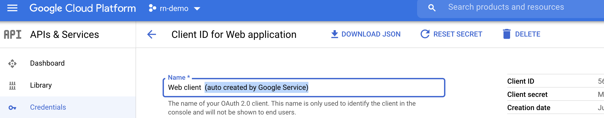

# rn-native-food-order-app 🐳


[](https://github.com/tquangdo/rn-native-food-order-app/issues/new)

## demos app


## setting firebase for react-native app

### 1/ firebase console
- create 1 project & 1 ios app + 1 web app (actually, NO need 1 web app!!!)
- with ios app: download `GoogleService-Info.plist` & add to xcode

- ~with web app: copy configure code & paste to `screens/Authentication/fbaseConfig.js`~

### 2/ src code: 
- `screens/Authentication/SignIn.js`
```js
import firebase from '@react-native-firebase/app';
import auth from '@react-native-firebase/auth';
import FB_CONFIG from './fbaseConfig'
if (!firebase.apps.length) {
    firebase.initializeApp(FB_CONFIG)
}
...
_onLoginFB = () => {
        .then(data => {
                const tmp_credentail = firebase.auth.FacebookAuthProvider.credential(data.accessToken)
                return auth().signInWithCredential(tmp_credentail)
            })
            ...
}
```

## setting facebook login for react-native app

### 1/ dev fb app & xcode
- https://developers.facebook.com/apps: create an dev fb app with `bundle id` = xcode > project name > General > `Bundle Identifier`
- https://developers.facebook.com/apps/315773463612906/fb-login/quickstart/: create fb-login > ios
- Step4: Configure Your info.plist

- Step5: Connect App Delegate
- add headder in `AppDelegate.m` file
```swift
#import <Firebase.h>
#import <FBSDKCoreKit/FBSDKCoreKit.h>
#import <FBSDKLoginKit/FBSDKLoginKit.h>
#import <FBSDKShareKit/FBSDKShareKit.h>
```

- xocde: create empty `file.swift` file

- xocde: menu Product > `Clean Build Folder`


### 2/ firebase
- firebase dashboard: authentication > sign-in method > facebook enable
- copy `App ID` & `App secret` from dev fb app

### 3/ src code: 
- `screens/Authentication/SignIn.js`
```js
import { AccessToken, LoginManager } from 'react-native-fbsdk'
...
_onLoginFB = () => {
        LoginManager
            .logInWithPermissions(['public_profile', 'email'])
            ...
}
```

## setting google login for react-native app
- https://github.com/react-native-google-signin/google-signin
- https://github.com/react-native-google-signin/google-signin/blob/master/docs/ios-guide.md

### 1/ xcode
- `FoodDeliveryLiteApp` > `Info` > `URL Types` > add new (2nd) > URL Schemes: copy paste from `GoogleService-Info.plist>REVERSED_CLIENT_ID`: `com.googleusercontent.apps.XXX`
- `AppDelegate.m` file
```swift
#import <RNGoogleSignin/RNGoogleSignin.h>
...
  [[FBSDKApplicationDelegate sharedInstance] application:application
                                                 openURL:url
                                                 options:options] || [RNGoogleSignin application:application openURL:url options:options];
```

### 2/ firebase
- firebase dashboard: authentication > sign-in method > google enable
- remove `Safelist client IDs from external projects (optional)` (different from Expo: must use with IOS client credential)
- use default for `Web SDK configuration`


### 3/ src code: 
- `screens/Authentication/fbaseConfig.js: WEB_CLIENT_ID=XXX..apps.googleusercontent.com`: copy paste from `GoogleService-Info.plist>CLIENT_ID`
- `screens/Authentication/SignIn.js`
```js
import { GoogleSignin } from '@react-native-community/google-signin'
...
async function _onLoginGG() {...}
```

## run local
```shell
$yarn react-native link
$cd ios && pod install --repo-update && cd ..
$yarn react-native start
$yarn react-native run-ios
```
- after login fb acc, there will exist fb login acc in firebase > authentication > users

